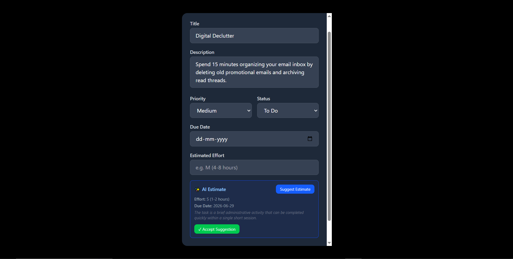
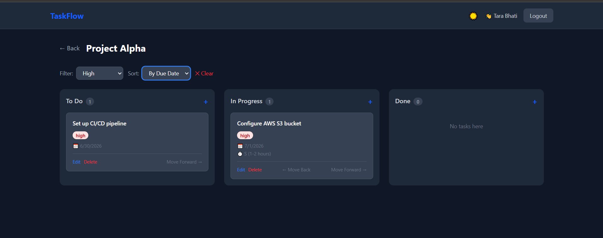
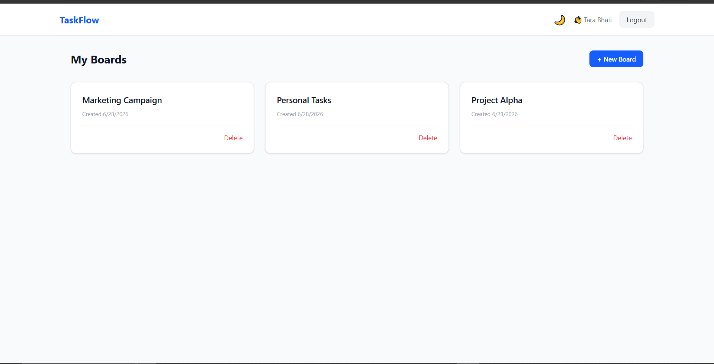
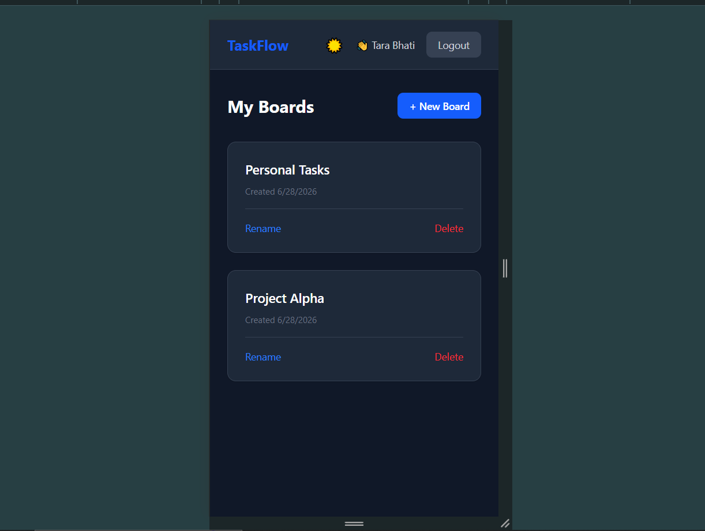

<div align="center">

# TaskFlow

### A Smart Task & Project Manager built with the MERN Stack


**[Live Demo](https://taskflow-omega-three-13.vercel.app) · [Backend API](https://taskflow-server-yiow.onrender.com) · [Report an Issue](https://github.com/harsshittabhati/Taskflow/issues)**

</div>

---

## Overview

TaskFlow is a full-stack Kanban-style project management application built from scratch. Users can register, log in, create project boards, and manage tasks across a three-column workflow — To Do, In Progress, and Done. The application features an AI-powered effort estimation engine that suggests task complexity and due dates using the Google Gemini API, called securely from the backend.

> Built as a take-home assignment for a Full Stack Developer position. Completed within the 3-day deadline and fully deployed.

---

## Live Demo

| | URL |
|---|---|
| Frontend | https://taskflow-omega-three-13.vercel.app |
| Backend API | https://taskflow-server-yiow.onrender.com |
| Test Email | `tara@test.com` |
| Test Password | `123456` |

> Note: The backend is hosted on Render's free tier and may take 30-50 seconds to respond after a period of inactivity.

---

## Screenshots

### Login Page


### Dashboard


### Board View


### AI Estimate Feature


### Filter and Sort


### Dark Mode


### Mobile View


---

## Features

### Authentication
- Register and login with email and password
- Passwords hashed with bcryptjs (10 salt rounds)
- JWT-based authentication with 7-day token expiry
- Session persists across page refreshes
- Protected routes redirect unauthenticated users to login
- Logout with confirmation prompt

### Boards
- Create, rename, and delete project boards
- Dashboard view with board cards and creation date
- Empty state with call-to-action for new users
- Delete confirmation with custom styled modal

### Tasks
- Three-column Kanban board (To Do, In Progress, Done)
- Create and edit tasks with title, description, priority, due date, and effort estimate
- Move tasks between columns with Move Forward and Move Back buttons
- Priority badges with color coding (High, Medium, Low)
- Overdue task detection with red border and label
- Filter tasks by priority level
- Sort tasks by priority or due date
- Delete task with confirmation modal

### AI-Powered Estimation
- Click Suggest Estimate inside any task modal
- Backend sends task title and description to Google Gemini API
- Returns effort size (S/M/L/XL), suggested due date, and reasoning
- One-click Accept fills the task fields automatically
- Graceful fallback if API is unavailable — app works normally

### UI and UX
- Dark mode and light mode toggle, preference persisted
- Fully responsive across mobile, tablet, and desktop
- Loading spinners on all data fetch operations
- Custom styled confirmation modals with blur overlay
- User-friendly error handling on all operations
- Custom 404 page

---

## Tech Stack

### Frontend
| Technology | Version | Purpose |
|---|---|---|
| React.js | 18 | UI framework |
| Vite | 8 | Build tool |
| React Router DOM | 6 | Client-side routing |
| Tailwind CSS | 4 | Styling |
| Axios | Latest | HTTP client |

### Backend
| Technology | Version | Purpose |
|---|---|---|
| Node.js | 24 | Runtime |
| Express.js | 5 | REST API framework |
| MongoDB | 6 | Database |
| Mongoose | 9 | ODM |
| bcryptjs | 3 | Password hashing |
| jsonwebtoken | 9 | JWT auth |
| express-validator | 7 | Input validation |
| @google/generative-ai | Latest | Gemini AI SDK |

### Infrastructure
| Service | Purpose |
|---|---|
| Vercel | Frontend hosting |
| Render | Backend hosting |
| MongoDB Atlas | Cloud database |

---

## Project Structure
```
taskflow/
├── client/                 # React frontend
│   ├── src/
│   │   ├── api/           # Axios API functions
│   │   ├── components/    # Reusable components (Navbar)
│   │   ├── context/       # Auth context
│   │   └── pages/         # Login, Register, Dashboard, BoardView, NotFound
│   └── .env.example
└── server/                 # Node.js backend
    ├── config/            # DB connection
    ├── controllers/       # Route handlers
    ├── middleware/        # JWT auth middleware
    ├── models/            # Mongoose models
    ├── routes/            # Express routes
    └── .env.example
```
---

## API Reference

### Auth
| Method | Endpoint | Auth | Description |
|---|---|---|---|
| POST | `/api/auth/register` | No | Register new user |
| POST | `/api/auth/login` | No | Login, returns JWT |
| GET | `/api/auth/me` | Yes | Get current user |

### Boards
| Method | Endpoint | Auth | Description |
|---|---|---|---|
| GET | `/api/boards` | Yes | Get all user boards |
| POST | `/api/boards` | Yes | Create board |
| GET | `/api/boards/:id` | Yes | Get board by ID |
| PUT | `/api/boards/:id` | Yes | Update board |
| DELETE | `/api/boards/:id` | Yes | Delete board |

### Tasks
| Method | Endpoint | Auth | Description |
|---|---|---|---|
| GET | `/api/tasks/board/:boardId` | Yes | Get tasks for a board |
| POST | `/api/tasks` | Yes | Create task |
| PUT | `/api/tasks/:id` | Yes | Update task |
| DELETE | `/api/tasks/:id` | Yes | Delete task |

### AI
| Method | Endpoint | Auth | Description |
|---|---|---|---|
| POST | `/api/ai/suggest` | Yes | Get AI effort estimate |

---

## Local Setup

### Prerequisites
- Node.js v18 or higher
- MongoDB running locally (or MongoDB Atlas URI)
- Google Gemini API key (free tier at aistudio.google.com)

### 1. Clone the repository

```bash
git clone https://github.com/harsshittabhati/Taskflow.git
cd Taskflow
```

### 2. Set up the backend

```bash
cd server
npm install
```

Create `server/.env` from `server/.env.example`:

```env
PORT=5000
MONGO_URI=mongodb://localhost:27017/taskflow
JWT_SECRET=your_long_random_secret_here
CLIENT_URL=http://localhost:5173
GEMINI_API_KEY=your_gemini_api_key_here
```

Start the backend:

```bash
npm run dev
```

### 3. Set up the frontend

```bash
cd client
npm install
```

Create `client/.env.development`:

```env
VITE_API_URL=http://localhost:5000/api
```

Start the frontend:

```bash
npm run dev
```

### 4. Open the app

Navigate to `http://localhost:5173` in your browser.

---

## Environment Variables

### Backend — server/.env

| Variable | Required | Description |
|---|---|---|
| PORT | Yes | Server port (default: 5000) |
| MONGO_URI | Yes | MongoDB connection string |
| JWT_SECRET | Yes | Secret for signing JWT tokens |
| CLIENT_URL | Yes | Frontend URL for CORS |
| GEMINI_API_KEY | Yes | Google Gemini API key |

### Frontend — client/.env.development

| Variable | Required | Description |
|---|---|---|
| VITE_API_URL | Yes | Backend API base URL |

---

## AI Feature

The Suggest Estimate feature uses Google Gemini API called exclusively from the backend. The API key is stored in the server environment and is never sent to the browser.

**Why Gemini:** Generous free tier, native JSON output mode, fast inference, and no billing required for development.

**Request flow:**
```
User clicks "Suggest Estimate"
        |
        v
Frontend  POST /api/ai/suggest  { title, description }
        |
        v
Backend constructs prompt and calls Gemini API
        |
        v
Gemini returns  { effort, suggestedDueDate, reasoning }
        |
        v
Backend returns clean JSON to frontend
        |
        v
User accepts or dismisses the suggestion
```
**Fallback:** If the API is unavailable, the backend returns a default estimate of M (4-8 hours) with a due date 7 days from today. The app remains fully functional.

---

## Data Models

### User
| Field | Type | Constraints |
|---|---|---|
| _id | ObjectId | Auto-generated |
| name | String | Required |
| email | String | Required, Unique |
| passwordHash | String | Required, bcrypt hashed |
| createdAt | Date | Auto-generated |
| updatedAt | Date | Auto-generated |

### Board
| Field | Type | Constraints |
|---|---|---|
| _id | ObjectId | Auto-generated |
| title | String | Required |
| description | String | Optional |
| owner | ObjectId | Required, Ref: User |
| createdAt | Date | Auto-generated |
| updatedAt | Date | Auto-generated |

### Task
| Field | Type | Constraints |
|---|---|---|
| _id | ObjectId | Auto-generated |
| title | String | Required |
| description | String | Optional |
| status | String | Enum: todo, in-progress, done |
| priority | String | Enum: low, medium, high |
| dueDate | Date | Optional |
| estimatedEffort | String | Optional |
| board | ObjectId | Required, Ref: Board |
| owner | ObjectId | Required, Ref: User |
| createdAt | Date | Auto-generated |
| updatedAt | Date | Auto-generated |

---

## Security

| Concern | Implementation |
|---|---|
| Passwords | Hashed with bcryptjs, never stored in plain text |
| Authentication | JWT with 7-day expiry, Bearer token scheme |
| Route protection | Middleware verifies token on every protected endpoint |
| Data isolation | All queries filter by `owner: req.user._id` |
| AI API key | Stored in server `.env` only, never exposed to client |
| Secrets | All secrets in `.env`, excluded via `.gitignore` |
| Validation | express-validator on all auth and data routes |

---

## Known Limitations

- The Render free tier backend spins down after inactivity. First request after idle may take 30-50 seconds.
- Drag-and-drop between columns is not implemented in this version. Tasks are moved using Move Forward and Move Back buttons.
- Local development uses a local MongoDB instance due to network restrictions on the development environment. Production uses MongoDB Atlas.

---

## Author

**Harshita Bhati**
B.Tech Computer Science (Cyber Security) — Poornima University, Jaipur
GitHub: [@harsshittabhati](https://github.com/harsshittabhati)

---

<div align="center">
Built with the MERN Stack · Deployed on Vercel and Render · AI powered by Google Gemini
</div>
